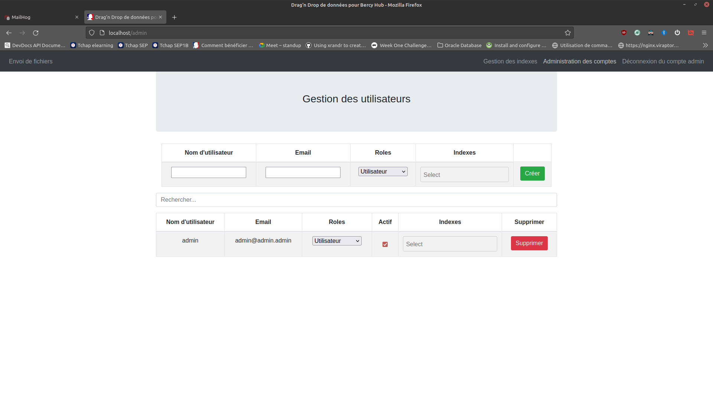
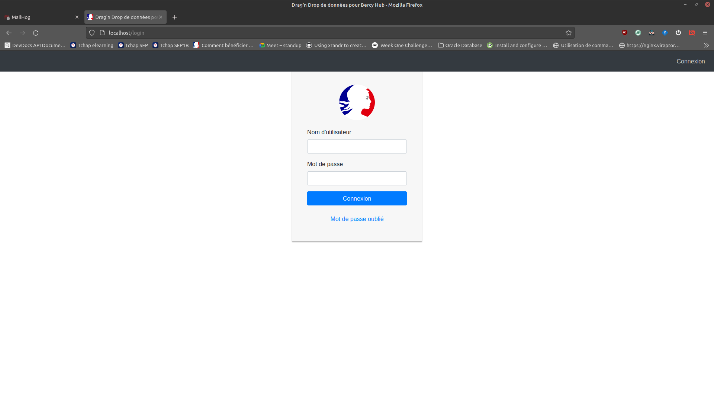
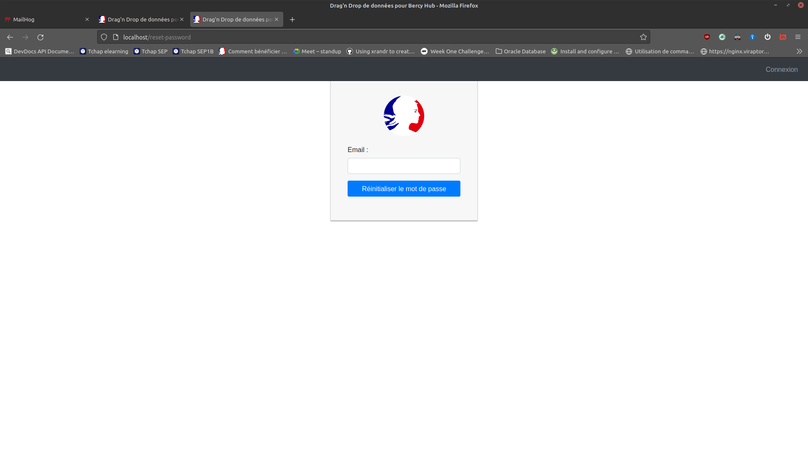
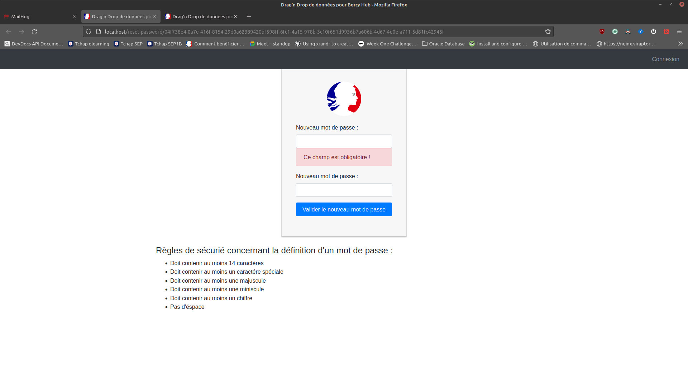
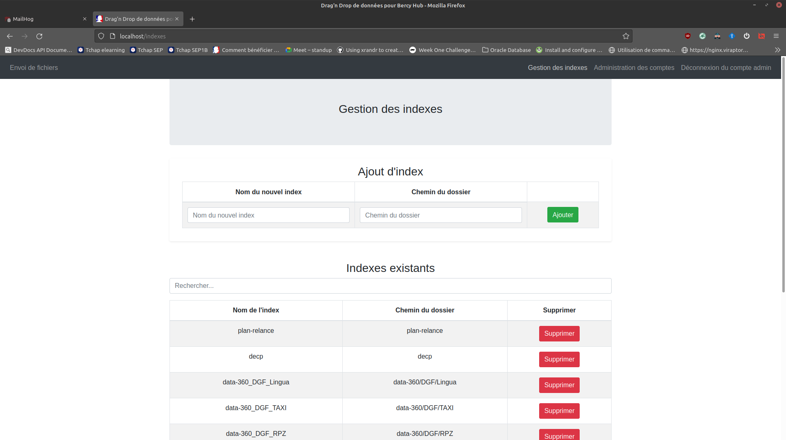
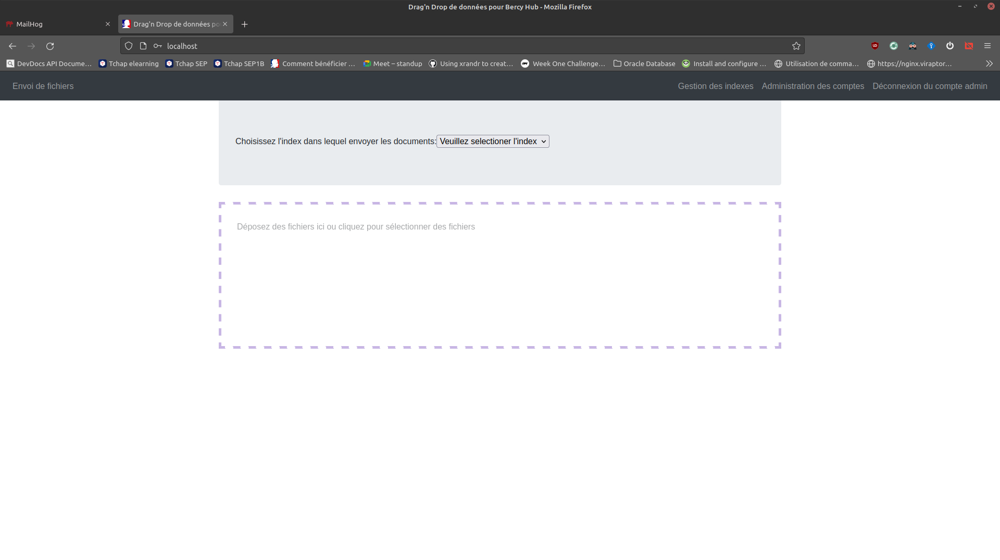

# Description des usages de Data Upload

L'objectif de Data-Upload est de fournir un outil permettant aux utilisateurs d'uploader des fichiers qui seront ensuite traités automatiquement pour les intégrer dans un système de données.

Notre première version utilise [PyPEL](https://github.com/139bercy/pypel) comme ETL et [Orchestrator-ETL](https://github.com/139bercy/orchestrator-ETL) comme outil d'orchestration des différents services.
Cette version est relativement simple et ne permet pas de gérer tous les cas d'usage.
Il impose notamment une proximité physique (sur la même machine) entre le service backend de Data-Upload et le service Orchestrator-ETL afin de partager un volume qui contient les données uploadées.
Il est possible d'éviter cette contrainte en utilisant un système de volume partagé entre machine par exemple mais ce sujet n'est pas abordé ici.

## Bandeau de l'application
Sur chacune des pages de l'application, un bandeau est disponible et liste les différentes fonctionnalités offertes par celle-ci.
Chacune de ces fonctionnalités est décrites dans le document ci-dessous.

Selon les droits attribués au compte connecté, certaines fonctionnalités n'apparaissent pas dans le bandeau.
Ci-dessous l'exemple d'un bandeau pour un compte administrateur.


## Gestion des comptes
La gestion des comptes se fait depuis la page liée à `Administration des comptes` dans le bandeau.

Cette page vous permet de visualiser les comptes existants, de les activer ou de les désactiver et de les lier à des indexes.

Il est aussi possible de créer un nouveau compte.

Ci-dessous un exemple de page de gestion des comptes.



3 types de rôle sont disponible dans l'application, chacun offrant l'accès à des fonctionnalités spécifique :
- `Utilisateur` permet de faire de l'upload de fichier
- `Modérateur` permet de gérer un sous-ensemble de compte afin de permettre à de nouveaux utilisateurs d'uploader des données
- `Administrateur` permet de gérer les index ainsi que les comptes administrateurs et modérateur.

### Page de connexion
La page de connexion est la première page que l'utilisateur voit de l'application. C'est la page lui permettant de s'authentifier afin de pouvoir accéder au fonctionnalités de l'application.


Ci-dessous un exemple de page de gestion des comptes.



Depuis cette page vous pouvez vous connecter grâce à votre nom d'utilisateur ou votre email et le mot de passe associé à votre compte.

Si vous ne vous rappelez plus de votre mot de passe, vous pouvez utiliser le lien `mot de passe oublié` afin de demander une réinitialisation de votre mot de passe.
### Pages de réinitialisation de mot de passe
Lorsque vous cliquez sur le lien `mot de passe oublié`, vous obtenez la page ci-dessous :

Cette page vous demande de saisir votre adresse email afin qu'un email vous soit envoyé. Dans ce mail, vous obtiendrez un lien permettant de faire la réinitilisation de votre mot de passe. Ce lien vous amènera à la page ci-dessous :

Dans cette page, vous allez effectuer la réinitialisation de votre mot de passe. Les règles qui lui sont associées sont décrites plus bas afin que vous puissiez définir un mot de passe robuste.

## Gestion des indexes
La page de gestion des indexes permet de gérer les différents traitements de données possible dans l'application. Un index est référencé lorsque l'on uploade un fichier afin de savoir quel(s) traitement(s) doit être appliqué à ce fichier.

Il est possible de créer ou de supprimer un index. Pour le moment l'édition d'un index n'est pas possible.
De plus la configuration de l'index n'est pas complètement disponible dans l'interface. Ici seul un nom de dossier peut être spécifié.
**Le reste de la configuration s'effectue par un fichier de configuration qui est enregistré sur le serveur lors du déploiement.**
**Un travail important est nécessaire notamment au niveau de l'UI/UX pour permettre de configurer dans sa globalité le traitement de données associé**

Ci-dessous un exemple de page de gestion des indexes.



## Upload de données
L'upload de données consiste à envoyer dans l'application Data-Upload un ou plusieurs fichiers qui seront traités ensuite pour être intégré dans un environnement ELK.
Potentiellement cette application ne dépend pas d'une intégration de données vers ELK, elle pourrait très bien être utilisé pour d'autres type d'ETL.

### Upload de données au travers d'une interface Web
L'upload de données est la principale fonctionnalité de l'application. C'est aussi la seul fonctionnalité mise à disposition de l'ensemble des utilisateurs.

Ci-dessous un exemple de page d'upload de fichier.



L'utilisateur doit choisir un index dans lequel les documents seront uploadé puis doit ensuite sélectionner le ou les fichiers qu'il souhaite uploader.

### Upload de données au travers d'une API web
L'ensemble des fonctionnalités de cette application est défini sur la base d'API. Ainsi chaque page peut appeler les routes offrant les fonctionnalités correspondantes ou nécessaire au fonctionnement de la page.

L'une de ces APIs permet donc d'uploader un fichier afin de l'intégrer dans un index.
Cette route est la suivante :
```sh
POST /api/upload/:index
```
Le paramètre `:index` permet de spécifier l'index dans lequel le fichier sera intégré.
Le `POST` signifie que c'est une requête HTTP de type POST.
La route prend aussi un fichier en paramètre sous forme de données `form-data`.

Un exemple de commande `curl` correspondant à son utilisant est donné ci-dessous :
```sh
curl "<http:// ou http:// mon serveur>/api/upload/mon-index" -X POST -H 'Accept: application/json, text/plain, */*' --compressed -H "x-api-token: <mon token me donnant accès à l'API>" -H 'Content-Type: multipart/form-data' -F "filename=@<le chemin d'accès de mon fichier>" -F "name=$(basename "<le chemin d'accès de mon fichier")"
```

Les informations entre `<>` sont des informations à spécifier selon l'usage.

#### Token d'authentification
L'authentification des utilisateurs se fait grâce à l'usage d'un token [JWT](https://jwt.io/). C'est une manière de faire largement répandu et facile d'utilisation pour authentifier un utilisateur et transmettre au navigateur un certains nombre d'information concernant l'utilisateur (droit d'accès par exemple).

Cependant ce mode d'authentification nécessite d'obtenir un token et donc d'effectuer une première authentification afin de le récupérer.

Dans le cadre d'une automatisation de tâche, il peut être intéressant de pouvoir se passer de cette requête pour obtenir un token.
C'est pourquoi nous avons aussi implémenté une authentification par token d'API. Ce token est stocké en base de données et doit être généré par l'utilisateur lui même.
Il peut ensuite être supprimé ou désactivé si besoin.

Dans l'exemple d'uplaod de fichier que vous pouvez voir plus haut c'est une authentification par ce type de token qui est spécifié grâce à l'usage du header `x-api-token`.
